<div align="center">
    
    <p>LinkedInPurry Logo</p>
</div>
# LinkInPurry - IF3110 Web-Based Development

## 🖥️ Project Overview
<div align="center">
    
    <p>Project Overview of LinkInPurry</p>
</div>

LinkInPurry is a web-based application aimed to assist secret agents, like Purry the Platypus, and other members of O.W.C.A. (Organisasi Warga Cool Abiez) in finding job opportunities. The platform provides features for both job seekers and companies to interact, post job openings, and manage job applications.

## 🔓 Key Features
| Feature                       | Description                                                            |
|-------------------------------|------------------------------------------------------------------------|
| **User Authentication**       | <ul><li>Separate authentication for Job Seekers and Companies.</li></ul>      |
| **Job Management**            | <ul><li>Companies can create, edit, and close job vacancies.</li></ul>       |
| **Job Application**           | <ul><li>Job Seekers can search, filter, and apply for jobs.</li></ul>         |
| **Responsive Design**         | <ul><li>The application is responsive and optimized for different screen sizes.</li></ul> |
| **Rich Text Editor**          | <ul><li>Implemented using quill.js for job descriptions and other rich text fields.</li></ul> |
| **Pagination and Sorting**    | <ul><li>Job listings are paginated and can be sorted based on various criteria.</li></ul> |
| **File Attachments**          | <ul><li>Companies can upload related job images, and applicants can attach CVs and videos.</li></ul> |

## 🚨 Bonus Features that we Implemented

| Feature                        | Description                                                                                                                                                     |
|--------------------------------|-----------------------------------------------------------------------------------------------------------------------------------------------------------------|
| **All Responsive Web Design**  | - All layouts are made responsive (minimum for sizes 1280 x 768 and 400 x 800).<br>- The display will adjust according to the screen size using CSS @media rules.<br>- Reference for media queries can be found at [W3Schools](https://www.w3schools.com/css/css_rwd_mediaqueries.asp). |
| **UI/UX like LinkedIn**       | - Create a UI/UX similar to the LinkedIn website design.<br>- Ensure a consistent and responsive design for every page.<br>- This may open opportunities for getting hired at LinkedIn with an attractive design. |
| **Data Export**                | - Allows companies to upload applicant lists in Excel or CSV format.<br>- This is useful for internal analysis, archiving, or reporting.<br>- The minimum content of the file should include: Name, Job applied for, Date of application, URL of CV and other attachments, Application status. |
| **Simple Job Recommendation**  | - Provides job recommendations to applicants based on their previous application history.<br>- Applicants can find relevant job openings without manual searching.<br>- Implementation examples include recommendations based on job categories and a "trend" system. |
| **Google Lighthouse**          | - An automated tool for improving web page quality.<br>- Conducts audits for performance, accessibility, and best practices.<br>- Ensure scores are above 90 for accessibility and above 80 for performance.<br>- Capture initial scores and document changes made to improve the scores. |


## 🪛 System Requirements

- **Client-Side:**
  - JavaScript, HTML, CSS (No frameworks like Bootstrap or Tailwind)
- **Server-Side:**
  - PHP (no frameworks like Laravel or CodeIgniter)
- **Database:**
  - PostgreSQL
- **Other Tools:**
  - Docker for containerization (Dockerfile and docker-compose.yml)

## ️️️⚙️ Installation Instructions

1. **Clone the Repository:**
   ```
   git clone https://github.com/Labpro-21/if3110-tubes-2024-k03-03
   ```

2. **Install Dependencies:**
   No external libraries are required, but make sure to have PHP and PostgreSQL installed.

3. **Running the Application:**
   - Using Docker:
     ```
     docker-compose up --build
     ```
   
4. **Access the Application:**
   Open your browser and go to `http://localhost:8080`.

## 🛠️ Usage Instructions

### Company Features:
- Create, edit, and close job listings.
- View and manage applications, including accepting or rejecting job seekers.

### Job Seeker Features:
- Search, filter, and apply for job listings.
- Track job application statuses.

## 📷 Screenshots

### 1. Login Page
<div align="center">
    
</div>

### 2. Register page
<div align="center">
    
</div>
<div align="center">
    
</div>

### 3. Home (Company)
<div align="center">
    
</div>

### 4. Detail Lowongan (Company)

<div align="center">
    
</div>

### 5. Tambah Lowongan (Company)
<div align="center">
    
</div>


### 6. Detail Pelamar
<div align="center">
    
</div>


### 7. Home (Jobseeker)
<div align="center">
    
</div>

### 8. Detail Lowongan (Jobseeker)
<div align="center">
    
</div>

### 9. Apply Lowongan
<div align="center">
    
</div>

### 10. Guest Mode
<div align="center">
    
</div>

### 11. Edit Lowongan
<div align="center">
    
</div>

### 12. Riwayat Apply
<div style="text-align: center;">
    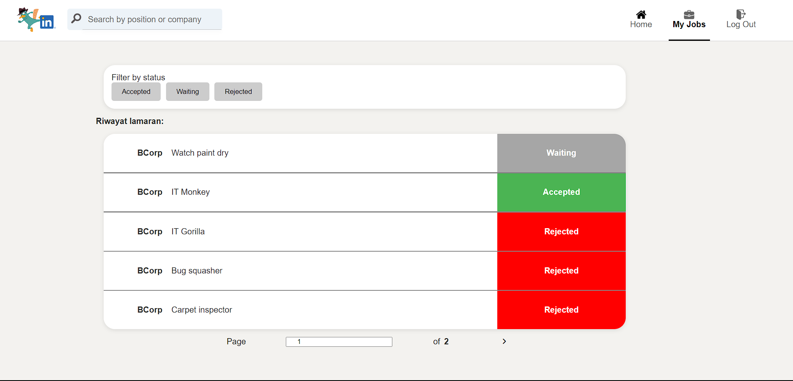
</div>

### 13. Profil Company
<div style="text-align: center;">
    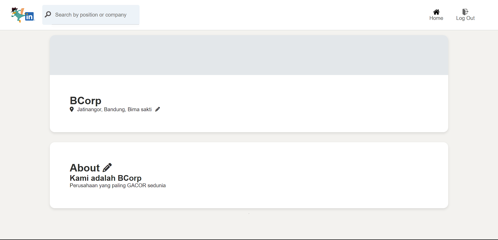
</div>

## 🔦 Lighthouse
### 1. Login Page
<div align="center">
    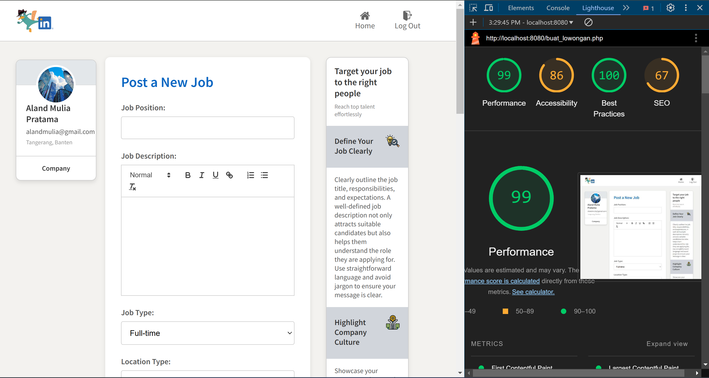
    <p>No Enhancement Needed</p>
</div>

### 2. Index Page
<div align="center">
    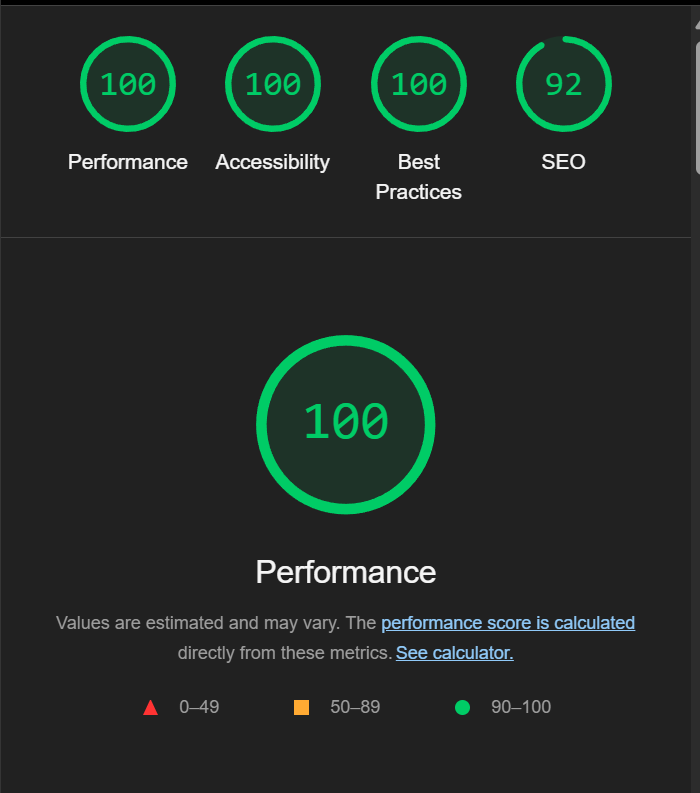
    <p>No Enhancement Needed</p>
</div>

### 3. 404 Page Not Found
<div align="center">
    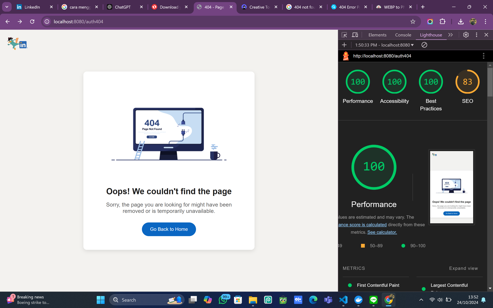
    <p>No Enhancement Needed</p>
</div>

### 4. Home Page (Job Seeker)
<div align="center">
    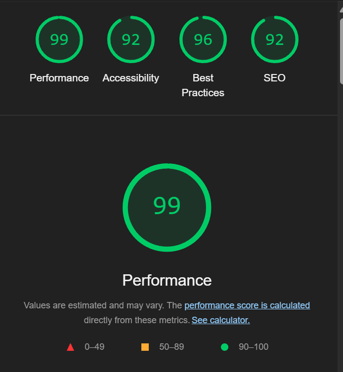
    <p>No Enhancement Needed</p>
</div>

### 5. Apply (Job Seeker)
<div align="center">
    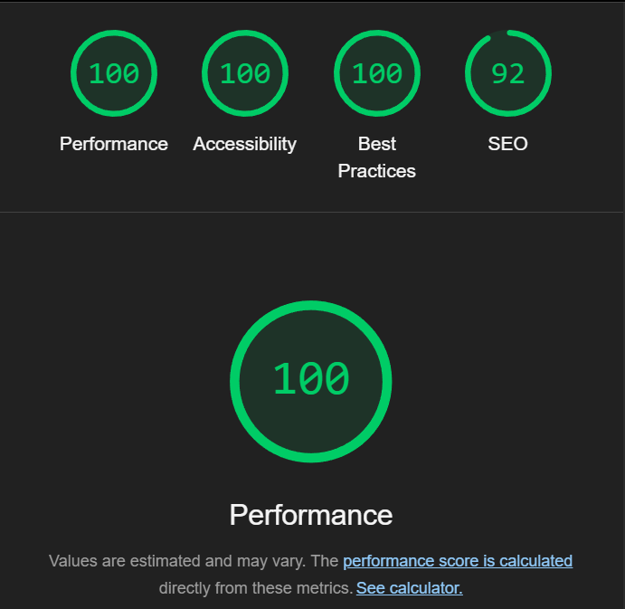
    <p>No Enhancement Needed</p>
</div>

### 6. Detail Lowongan (Job Seeker)
<div align="center">
    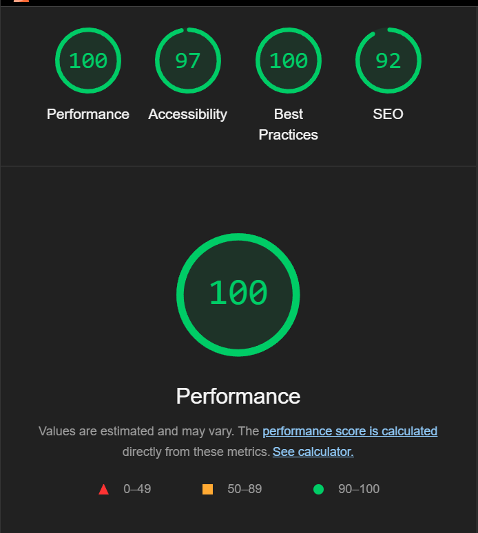
    <p>No Enhancement Needed</p>
</div>

### 7. Buat Lowongan (Company)
<div align="center">
    
    <p>Before Enhancement</p>
</div>
<div align="center">
    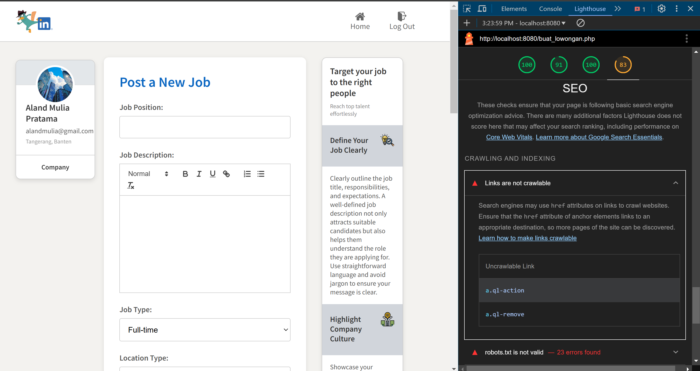
    <p>After Enhancement</p>
</div>

### 8. Detail Lamaran (Company)
<div align="center">
    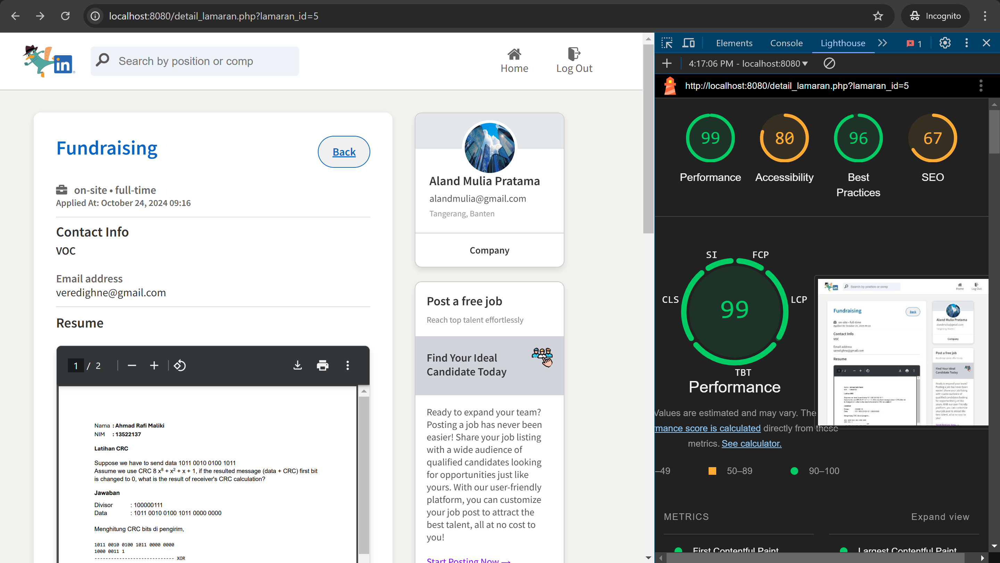
    <p>Before Enhancement</p>
</div>
<div align="center">
    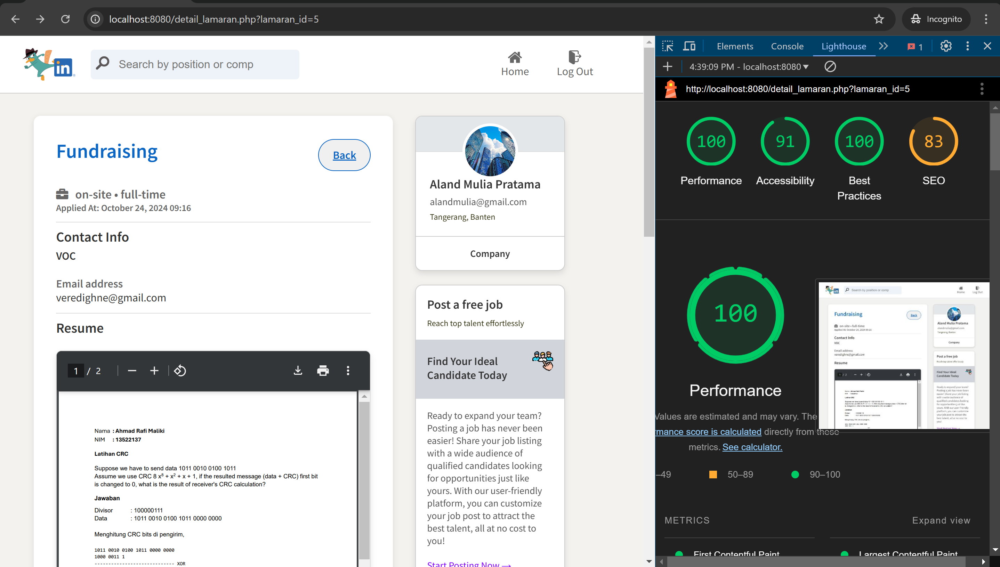
    <p>After Enhancement</p>
</div>

### 9. Edit Lowongan (Company)
<div align="center">
    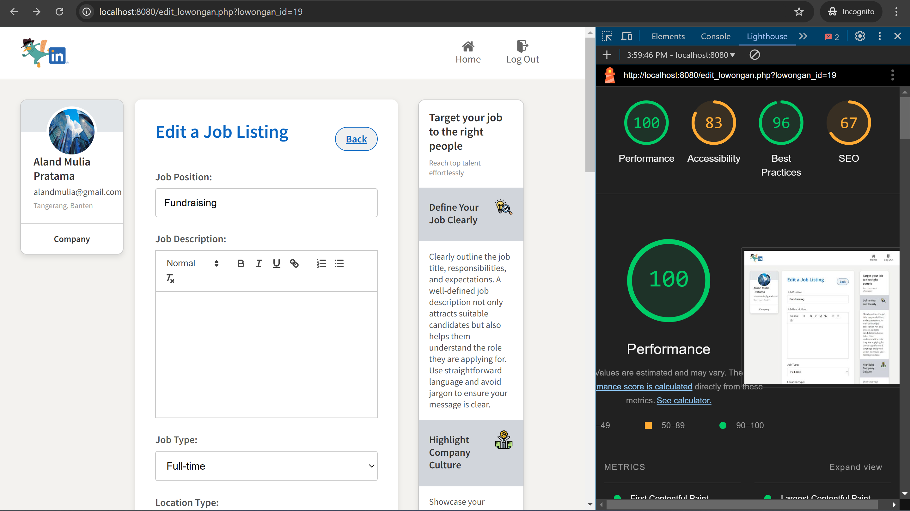
    <p>Before Enhancement</p>
</div>
<div align="center">
    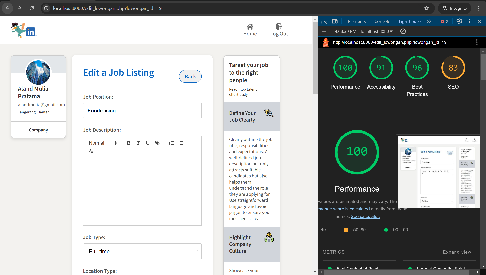
    <p>After Enhancement</p>
</div>

### 10. Home Page (Company)
<div align="center">
    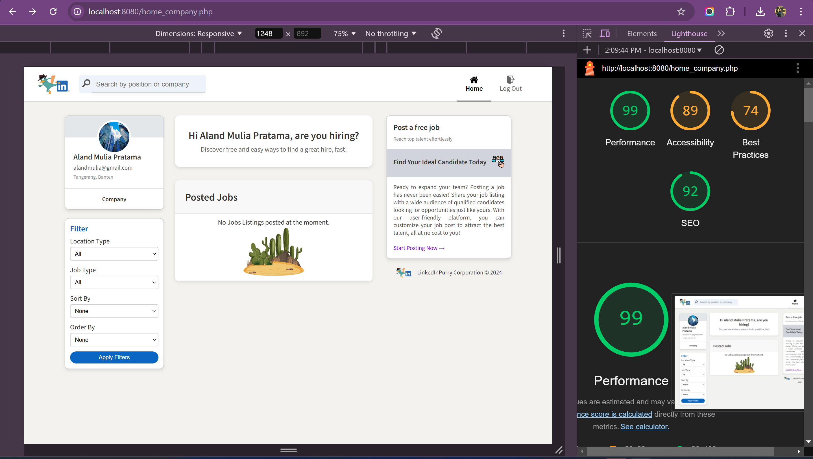
    <p>Before Enhancement</p>
</div>
<div align="center">
    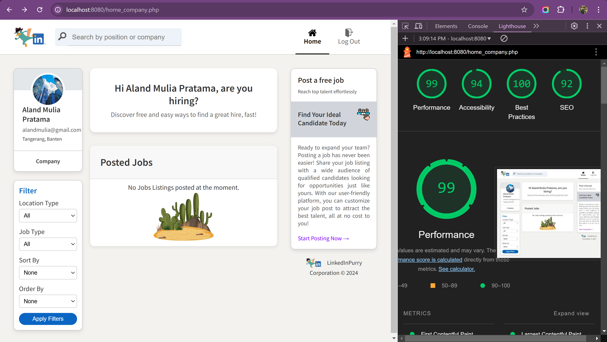
    <p>After Enhancement</p>
</div>

### 11. Lowongan Detail (Company)
<div align="center">
    
    <p>Before Enhancement</p>
</div>
<div align="center">
    
    <p>After Enhancement</p>
</div>

### 12. Riwayat Apply
<div style="text-align: center;">
    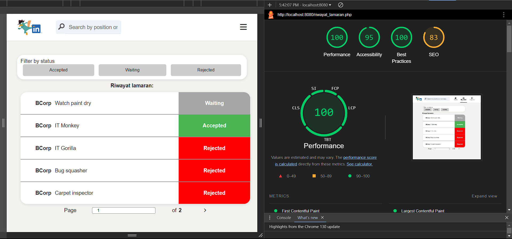
</div>

### 13. Profile Company
<div style="text-align: center;">
    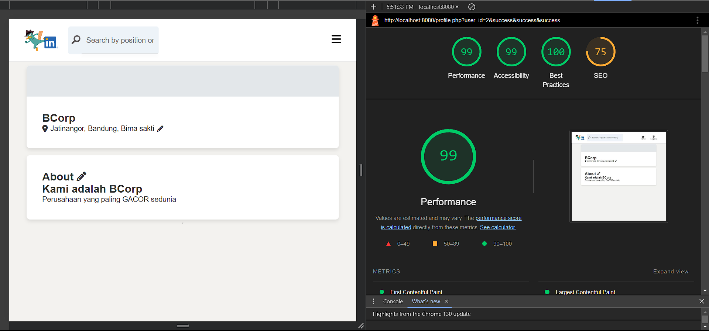
</div>

### Lighthouse Performance Summary

For each page tested using Google Lighthouse, we ensured that the metrics for **Best Practices**, **Performance**, and **Accessibility** were consistently above 90. This was achieved through various optimizations, including:

- **Best Practices:** We ensured that the application adheres to modern web development standards by fixing issues such as insecure links, using HTTPS for all resources, and eliminating unused JavaScript.
- **Performance:** We optimized page load times by minimizing and compressing CSS, JavaScript, and images. Lazy loading was applied to large images, and caching strategies were improved.
- **Accessibility:** We improved accessibility by implementing semantic HTML tags, ensuring proper color contrast, providing alt text for images, and optimizing navigation for screen readers.

## Task Allocation
| Feature                               | Server-Side (PHP)       | Client-Side (HTML, CSS, JS) |
|---------------------------------------|--------------------------|------------------------------|
| Login/Logout                          | 13522146                 | 13522146                     |
| Register                              | 13522146, 13522130      | 13522146, 13522130           |
| Halaman Home (JobSeeker)             | 13522146, 13522124      | 13522146, 13522124           |
| Halaman Home (Company)                | 13522146, 13522124      | 13522146, 13522124           |
| Halaman Tambah Lowongan (Company)    | 13522146                 | 13522124, 13522146           |
| Halaman Detail Lowongan (Company)     | 13522146                 | 13522124                     |
| Halaman Detail Lamaran (Company)      | 13522146                 | 13522124                     |
| Halaman Edit Lowongan (Company)       | 13522124                 | 13522124, 13522146           |
| Halaman Detail Lowongan (JobSeeker)   | 13522146                 | 13522146                     |
| Halaman Lamaran (JobSeeker)           | 13522146                 | 13522146                     |
| Halaman Riwayat (JobSeeker)           | 13522130                 | 13522130                     |
| Halaman Profil (Company)              | 13522130                 | 13522130                     |


## 📦 Deliverables

- **Final Submission:** 25th October 2024, 23.59 WIB
- **Milestones:**
  - Milestone 1 focuses on completing the core features and ensuring a functional web application.
  - Further milestones will expand upon this foundation, adding advanced features and optimizations.


