# LinkInPurry - IF3110 Web-Based Development

## Project Overview


LinkInPurry is a web-based application aimed to assist secret agents, like Purry the Platypus, and other members of O.W.C.A. (Organisasi Warga Cool Abiez) in finding job opportunities. The platform provides features for both job seekers and companies to interact, post job openings, and manage job applications.

## Key Features

- **User Authentication:** Separate authentication for Job Seekers and Companies.
- **Job Management:** Companies can create, edit, and close job vacancies.
- **Job Application:** Job Seekers can search, filter, and apply for jobs.
- **Responsive Design:** The application is responsive and optimized for different screen sizes.
- **Rich Text Editor:** Implemented using quill.js for job descriptions and other rich text fields.
- **Pagination and Sorting:** Job listings are paginated and can be sorted based on various criteria.
- **File Attachments:** Companies can upload related job images, and applicants can attach CVs and videos.

## System Requirements

- **Client-Side:**
  - JavaScript, HTML, CSS (No frameworks like Bootstrap or Tailwind)
- **Server-Side:**
  - PHP (no frameworks like Laravel or CodeIgniter)
- **Database:**
  - PostgreSQL
- **Other Tools:**
  - Docker for containerization (Dockerfile and docker-compose.yml)

## Installation Instructions

1. **Clone the Repository:**
   ```
   git clone https://github.com/Labpro-21/if3110-tubes-2024-k03-03
   ```

2. **Install Dependencies:**
   No external libraries are required, but make sure to have PHP and PostgreSQL installed.

3. **Running the Application:**
   - Using Docker:
     ```
     docker-compose up --build
     ```
   
4. **Access the Application:**
   Open your browser and go to `http://localhost:8080`.

## Usage Instructions

### Company Features:
- Create, edit, and close job listings.
- View and manage applications, including accepting or rejecting job seekers.

### Job Seeker Features:
- Search, filter, and apply for job listings.
- Track job application statuses.

## Screenshots

### 1. Login Page
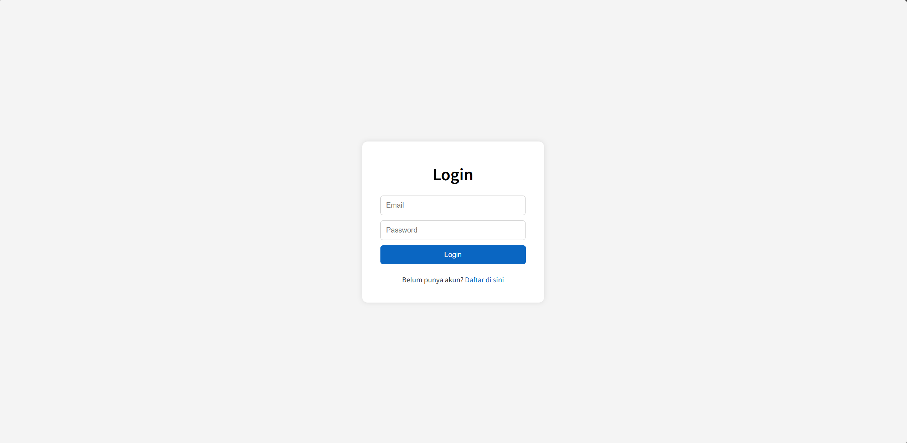

### 2. Register page
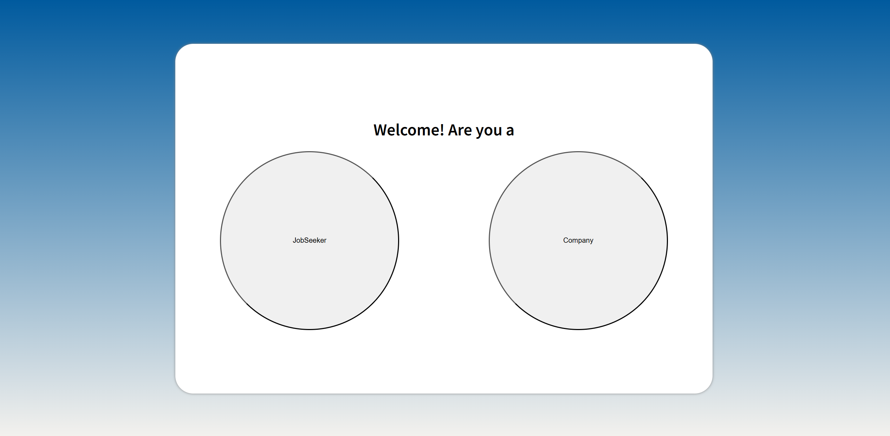
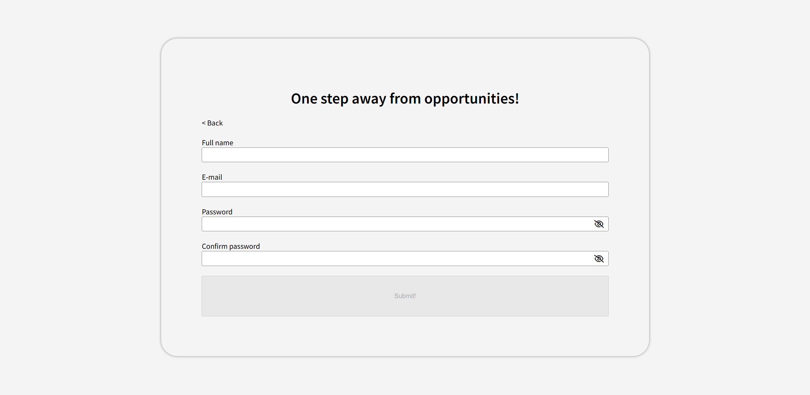

### 3. Home (Company)
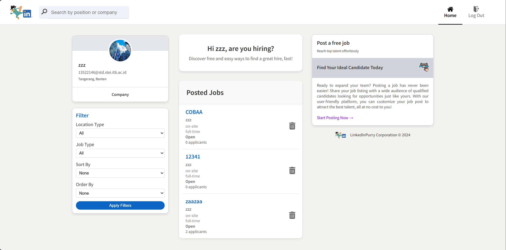

### 4. Detail Lowongan (Company)
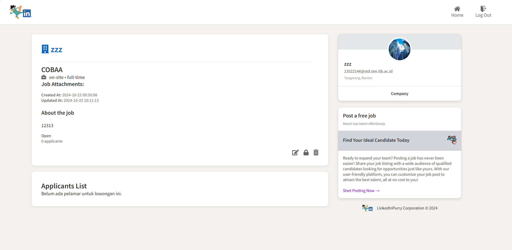

### 5. Tambah Lowongan (Company)
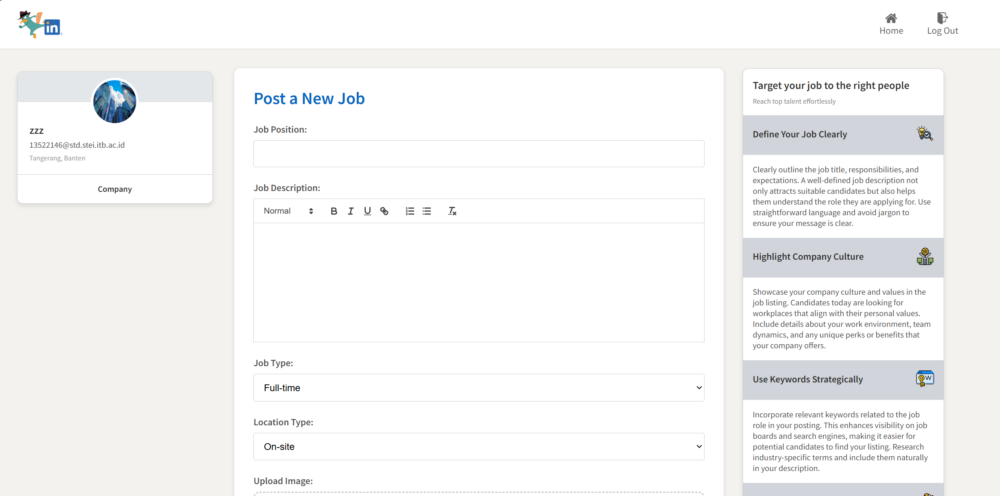

### 6. Detail Pelamar
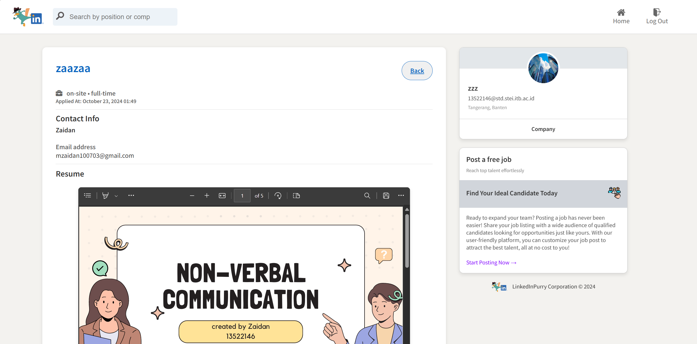

### 7. Home (Jobseeker)
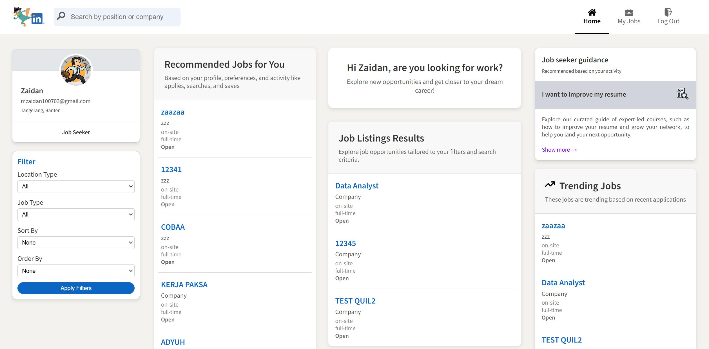

### 8. Detail Lowongan (Jobseeker)
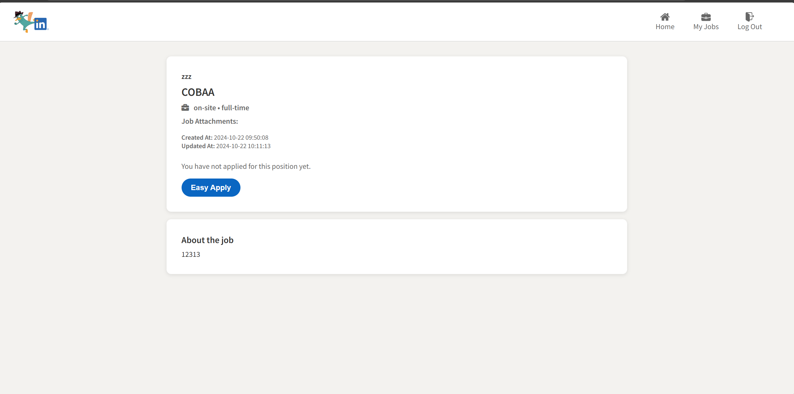

### 9. Apply Lowongan
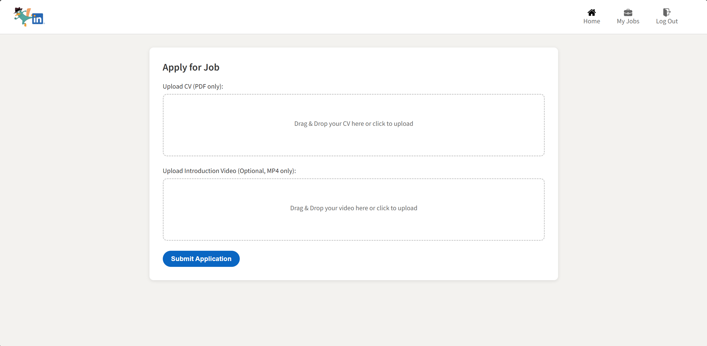

### 10. Guest Mode
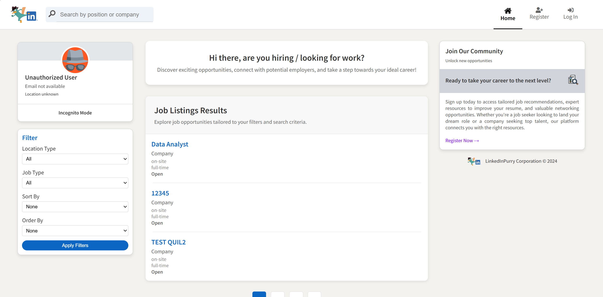

### 10. Edit Lowongan
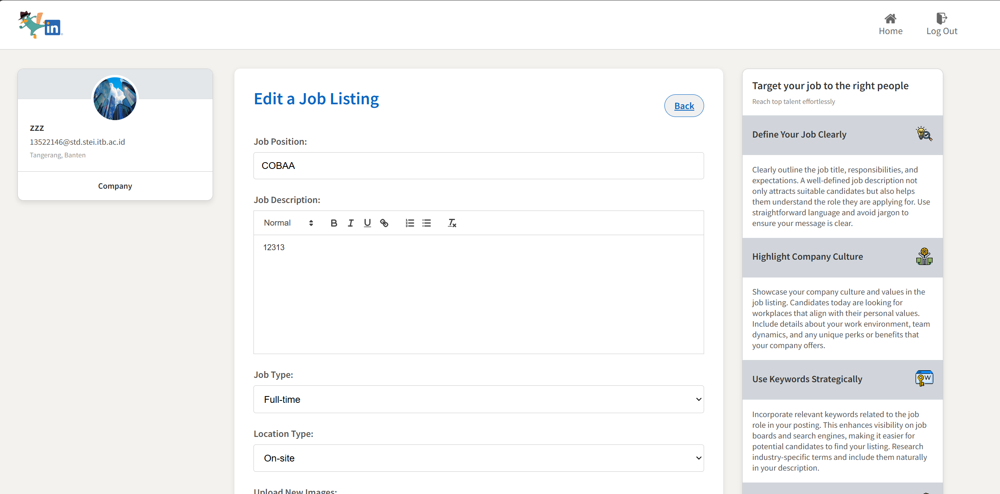

### 12. Riwayat Apply


### 13. Profil Company


## Lighthouse

### 1. Login Page


### 2. Home Page (Job Seeker)


### 3. Job Listing Page (Company)


## Task Allocation

- **Server-Side (PHP):**
  - Login/Logout: 13522146
  - Register: 13522146, 13522130
  - Halaman Home (JobSeeker): 13522146, 13522124
  - Halaman Home (Company): 13522146, 13522124
  - Halaman Tambah Lowongan (Company): 13522146
  - Halaman Detail Lowongan (Company): 13522146
  - Halaman Detail Lamaran (Company): 13522146
  - Halaman Edit Lowongan (Company): 13522124
  - Halaman Detail Lowongan (JobSeeker): 13522146
  - Halaman Lamaran (JobSeeker): 13522146
  - Halaman Riwayat (JobSeeker): 13522130
  - Halaman Profil(Company): 13522130

- **Client-Side (HTML, CSS, JS):**
  - Login/Logout: 13522146
  - Register: 13522146, 13522130
  - Halaman Home (JobSeeker): 13522146, 13522124
  - Halaman Home (Company): 13522146, 13522124
  - Halaman Tambah Lowongan (Company): 13522124, 13522146
  - Halaman Detail Lowongan (Company): 13522124
  - Halaman Detail Lamaran (Company): 13522124
  - Halaman Edit Lowongan (Company): 13522124, 13522146
  - Halaman Detail Lowongan (JobSeeker): 13522146
  - Halaman Lamaran (JobSeeker): 13522146
  - Halaman Riwayat (JobSeeker): 13522130
  - HalamanProfil(Company): 13522130

## Deliverables

- **Final Submission:** 24th October 2024, 21.00 WIB
- **Milestones:**
  - Milestone 1 focuses on completing the core features and ensuring a functional web application.
  - Further milestones will expand upon this foundation, adding advanced features and optimizations.


